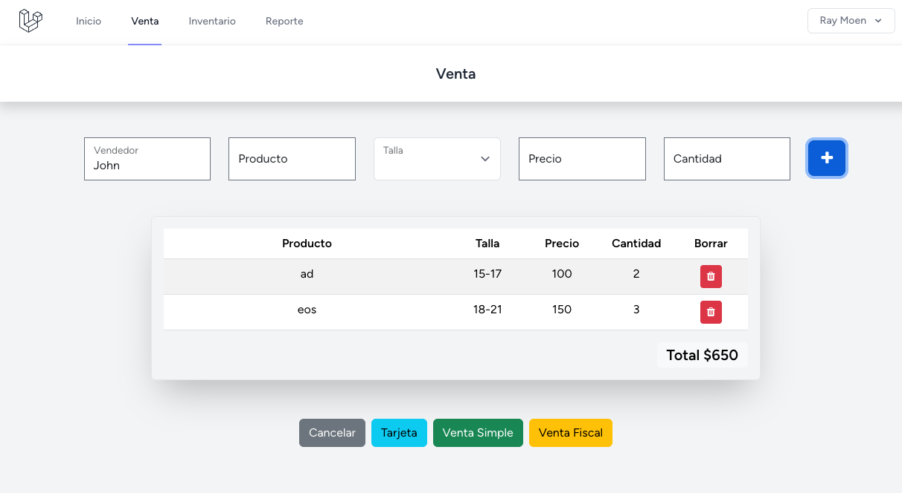
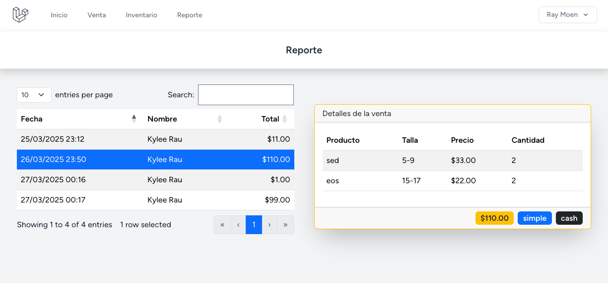

# CityShoesDesktop

Small application for a shoes shop using Laravel + Inertia + NativePHP 🚀

_Work in progress_ 😉

## Tech Stack

**Client:** Inertia, Vue3, BootstrapCSS, TailwindCSS

**Server:** PHP8.1, Laravel 10


## Screenshots







## Run Locally

Clone the project

```bash
  git clone git@github.com:chrisbaltazar/cityshoesdesktop.git
```

Go to the project directory

```bash
  cd cityshoesdesktop
```

Install dependencies

```bash
  composer install
```

```bash
  npm install
```

Start the server

```bash
  npm run dev   
```

```bash
  php artisan serve
```

## Running Tests

To run tests, run the following command

```bash
  php artisan test
```


## License

[MIT](https://choosealicense.com/licenses/mit/)

